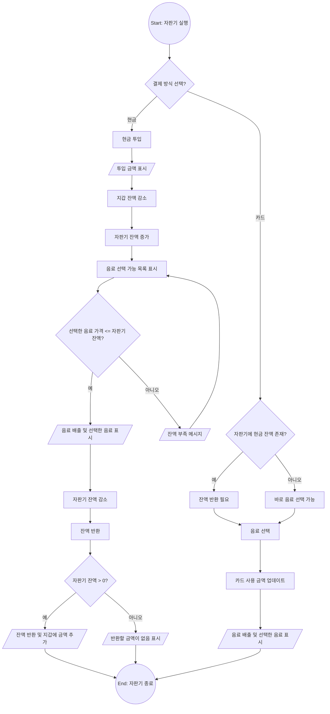

# Vending Machine

Next.js와 TypeScript로 만든 간단한 자판기 웹애플리케이션입니다. [(Live Demo)](https://vending-machine-sample-page.netlify.app)

## Screenshots/Live Demo

| img1  | img2  |
| :---: | :---: |
|  |  |

## 사용된 라이브러리 및 버전

- [Next.js](https://nextjs.org/) - 15.5.0
- [React](https://reactjs.org/) - 19.1.0
- [TypeScript](https://www.typescriptlang.org/) - ^5
- [Tailwind CSS](https://tailwindcss.com/) - ^4
- [Lucide Icons](https://lucide.dev/) - 0.541.0

## 기능

- 현금/카드 선택 가능 (현금 단위: 100~10000, 카드 무제한)
- 음료 선택: 콜라(1100), 물(600), 커피(700)
- 잔액 관리: 투입/차감/반환, 카드 사용 금액 누적
- UI 표시: 지갑 잔액, 자판기 투입 금액, 카드 사용 금액, 기타 메시지

## 플로우차트 다이어그램



## 디렉토리 구조

```
src
├── app              # App Router 기반 페이지
│   ├── layout         # 메인 레이아웃 컴포넌트
│   └── page           # 자판기 메인 페이지
└── components       # 컴포넌트 관리
    ├── money        # 결제 수단 관련 컴포넌트
    │   ├── index      # 결제 수단 선택
    │   ├── bill       # 지폐
    │   ├── coin       # 동전
    │   └── card       # 카드
    └── constant     # 상수 관리
        └── price      # 가격 정보 상수
```

## 실행 방법

```bash
npm install
```

```bash
npm run dev
```
